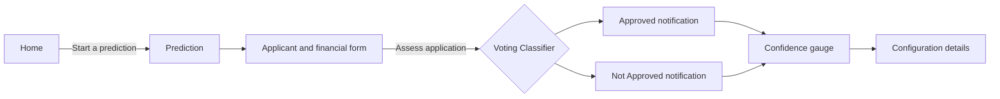

# AI Loan Approval Prediction (LoanLens)

  <p>
    
    
    
    
  </p>

> A dark, animated loan decision workspace powered by an optimized Voting Classifier.

`Streamlit` · `Python` · `scikit-learn` · `LightGBM` · `Optuna`

An interactive Streamlit application that predicts loan approval from applicant financial and profile information. The project compares multiple classification approaches, tunes a soft Voting Classifier with Optuna, and exposes the selected model through a dark, animated web interface with a working Home, Prediction, and Configuration navigation flow.

## What is included

```text
AI Loan Approval Prediction/
|-- app.py                                      Streamlit web application
|-- ui/                                         UI notes and presentation assets guide
|-- assets/                                     Images used by the Streamlit interface
|-- requirements.txt                            Python dependencies
|-- models/
|   `-- loan_approval_voting_classifier.joblib  Saved model bundle
|-- data/
|   |-- raw/data.csv                            Original dataset
|   `-- preprocessed/final.csv                  Training-ready dataset
|-- notebooks/
|   |-- data_exploration.ipynb                  Exploratory analysis
|   |-- train_model.ipynb                        Model comparison
|   `-- best_model.ipynb                        Hyperparameter tuning and final model
`-- outputs/images/                              Generated exploration figures
```

## Product preview

The interface uses two focused visual assets to make the workflow feel like a real decision product:

### Home: approval signal


**File:** `assets/approved.jpg`  
**UI location:** Home page, top visual card  
**Label:** `Approved outcome`

### Prediction: loan profile


**File:** `assets/loan.jpg`  
**UI location:** Prediction page, top-right visual card  
**Label:** `Loan profile`

The images are intentionally small in the app: `approved.jpg` sits at the top of Home, while `loan.jpg` sits at the top-right of Prediction beside the applicant form introduction.

## Model result

The deployed artifact is the optimized **soft Voting Classifier**, combining:

- Logistic Regression
- Random Forest
- LightGBM

The saved notebook evaluation reports these 5-fold cross-validation results:

| Metric | Score |
| --- | ---: |
| Accuracy | 0.9866 |
| Precision | 0.9857 |
| Recall | 0.9789 |
| F1-score | 0.9823 |

Optuna reported a best tuning accuracy of 0.9871. The original, unweighted Voting Classifier reached 0.9843 accuracy and 0.9950 precision. These are cross-validation results, not a guarantee for future applications.

## Run the app

Use Python 3.10 or newer in a virtual environment:

```bash
python -m venv .venv
```

Windows PowerShell:

```powershell
.\.venv\Scripts\Activate.ps1
pip install -r requirements.txt
streamlit run app.py
```

The app will open at `http://localhost:8501`.

## Using the interface

1. Use the top navigation to switch between **Home**, **Prediction**, and **Configuration**.
2. On Home, review the model status, then select **Start a prediction**.
3. On Prediction, enter the applicant profile and financial values.
4. Select **Assess application**.
5. Review the explicit **Approved** or **Not Approved** notification, confidence gauge, CIBIL score, and loan-to-income signal.

The interface uses CSS motion for page entrance, a subtle header scan, status breathing, card reveals, button hover movement, and result transitions. It intentionally does not use balloon effects or a light-theme toggle.

### Interaction flow



<details>
<summary><strong>What feels animated?</strong></summary>

- The hero and panels enter with a short upward reveal.
- A thin scan line moves across the hero header.
- The online status dot gently breathes to signal readiness.
- Buttons lift slightly on hover.
- The decision result arrives with a scale-and-rise transition.
- Streamlit toast and success/error notifications appear after submission.

</details>

## UI and image assets

The presentation layer lives in `app.py`, with design notes in `ui/README.md`. The table below is the source of truth for which image belongs to which screen or analysis context:

| Asset | Screen / location | UI role | Display behavior |
| --- | --- | --- | --- |
| `approved.jpg` | Home top | Approval outcome visual | Small fixed-width card, labeled `Approved outcome` |
| `loan.jpg` | Prediction top-right | Loan profile visual | Small fixed-width card, labeled `Loan profile` |
| `outputs/images/pairplot.png` | Analysis asset | Feature relationship overview | Stored for notebook analysis; not rendered in the app |
| `outputs/images/correlation_heatmap.png` | Analysis asset | Feature correlation context | Stored for notebook analysis; not rendered in the app |
| `outputs/images/cibil_score_distribution.png` | Analysis asset | CIBIL distribution | Stored for notebook analysis; not rendered in the app |
| `outputs/images/loan_amount_distribution.png` | Analysis asset | Loan amount distribution | Stored for notebook analysis; not rendered in the app |

These files are stored in `assets/` and loaded relative to the project root. The original exploratory copies remain in `outputs/images/`.

<details>
<summary><strong>Asset links</strong></summary>

- [approved.jpg](assets/approved.jpg)
- [loan.jpg](assets/loan.jpg)
- [pairplot.png](outputs/images/pairplot.png)
- [correlation_heatmap.png](outputs/images/correlation_heatmap.png)
- [cibil_score_distribution.png](outputs/images/cibil_score_distribution.png)
- [loan_amount_distribution.png](outputs/images/loan_amount_distribution.png)

</details>

## Model artifact

`models/loan_approval_voting_classifier.joblib` contains a dictionary with:

- `model`: fitted Voting Classifier
- `scaler`: fitted StandardScaler
- `feature_names`: ordered input columns required by the model

The app loads this bundle relative to its own location, so it can be launched from the project root or another working directory.

## Input features

The model expects the following preprocessed numeric fields:

`no_of_dependents`, `education`, `self_employed`, `income_annum`, `loan_amount`, `loan_term`, `cibil_score`, `residential_assets_value`, `commercial_assets_value`, `luxury_assets_value`, and `bank_asset_value`.

The app maps the visible Graduate/Not graduate and Self-employed/No controls to the numeric encoding used in `final.csv`.

## Re-training

Run the cells in `notebooks/best_model.ipynb` in order. The final save cell writes a new model bundle to `models/loan_approval_voting_classifier.joblib`. After retraining, restart Streamlit so its cached model resource reloads.

## Important limitations

- The application is a demonstration of model-assisted decision support, not a lending approval system.
- Validate fairness, calibration, drift, regulatory requirements, and business policy before production use.
- Add a separate untouched test set and threshold analysis before claiming production performance.
- The current form assumes that the preprocessed dataset encoding remains unchanged.

## Quick links

- [Launch instructions](#run-the-app)
- [Interaction flow](#interaction-flow)
- [UI and asset map](#ui-and-image-assets)
- [UI layer notes](ui/README.md)
